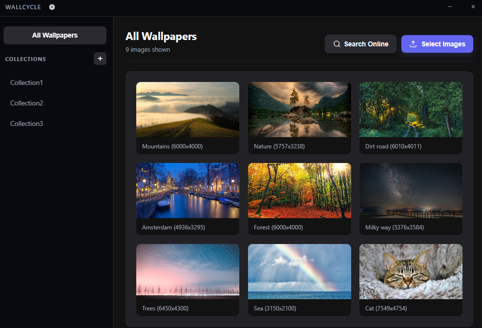

A simple desktop wallpaper switcher built with Electron and Node.js. Runs on Windows and uses PowerShell Win32 API calls to change backgrounds.

Features:

Add images from your local folders or search/download straight from Pixabay using your own API key.

